# 🛋️ NEXUS – Full-Stack E-Commerce Furniture Website

NEXUS is a **full-stack e-commerce web app** built for a fictional furniture brand.  
It combines a **responsive Bootstrap frontend** with a **Node.js/Express.js + MongoDB backend**, featuring secure, **email-verified authentication** and a smooth shopping experience.  

---

## 🚀 Tech Stack
- 🎨 **Frontend:** HTML, CSS, Bootstrap, JavaScript  
- ⚙️ **Backend:** Node.js, Express.js  
- 🗄️ **Database:** MongoDB (Mongoose)  

---

## ✨ Key Features
- 🔑 **Email-verified Authentication** – Sign up, login, logout, with email validation  
- 🛍️ **Product Catalog** – Grid & list views, search, filters, product detail pages  
- 🛒 **Shopping Cart** – Add/remove/update quantities; persists across sessions  
- 💳 **Checkout** – Apply discount codes/coupons, view order summary & confirmation  
- 💬 **Reviews & Comments** – Authenticated users can leave feedback  
- 👤 **Account Area** – Profile updates, order history, saved addresses  
- 📱 **Responsive UI** – Mobile-first design powered by Bootstrap  
- 🔒 **Secure APIs** – RESTful routes with input validation & error handling  

---

## 📑 Pages / Routes
| Page                  | Description |
|-----------------------|-------------|
| 🏠 **Homepage**       | Featured products & brand highlights |
| 🛍️ **Shop**           | Product catalog with filters & search |
| 📦 **Product Detail** | Individual product pages |
| 🛒 **Cart**           | Shopping cart with live updates |
| 💳 **Checkout**       | Order summary, discounts, confirmation |
| 👤 **Account**        | Profile, orders, addresses |
| ℹ️ **About**          | Brand info |
| 📞 **Contact**        | Contact form |
| 🔐 **Auth**           | Login / Signup with email verification |

---
## 📸 Screenshots  

### 🏠 Homepage & Shop  
<p align="center">
  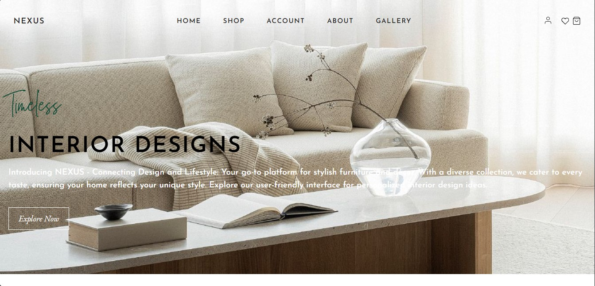
  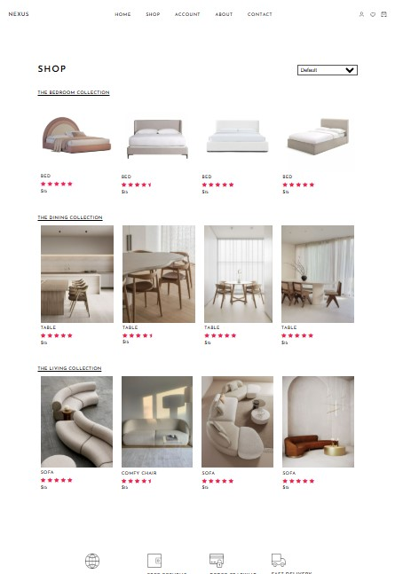
</p>

### 🛒 Cart & Categories  
<p align="center">
  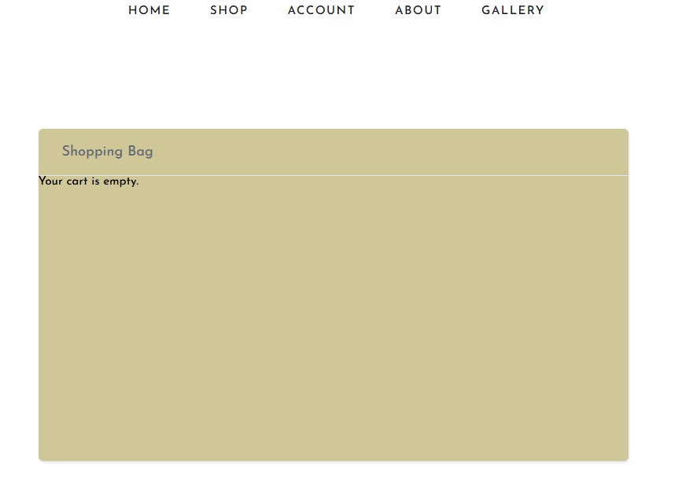
  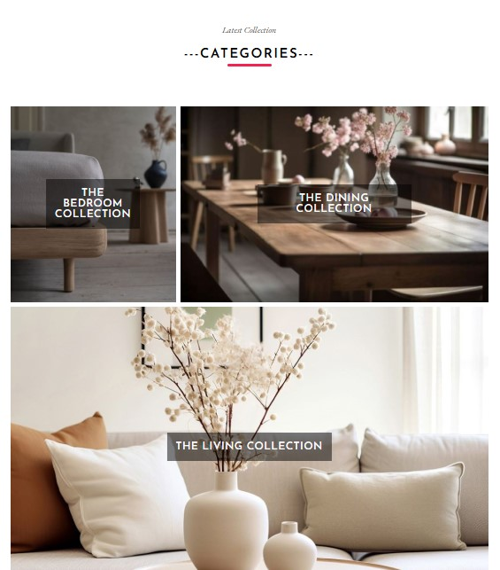
</p>

### 🛋️ Collections  
<p align="center">
  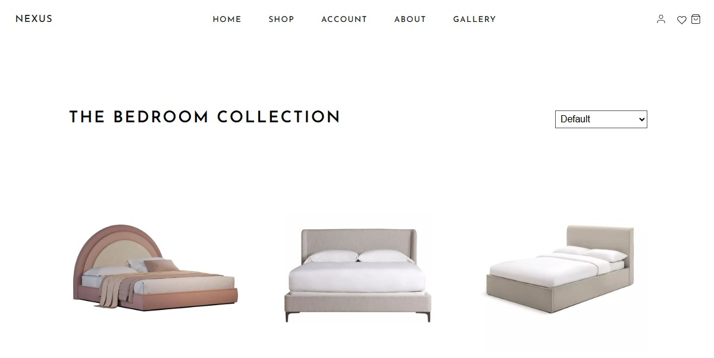
  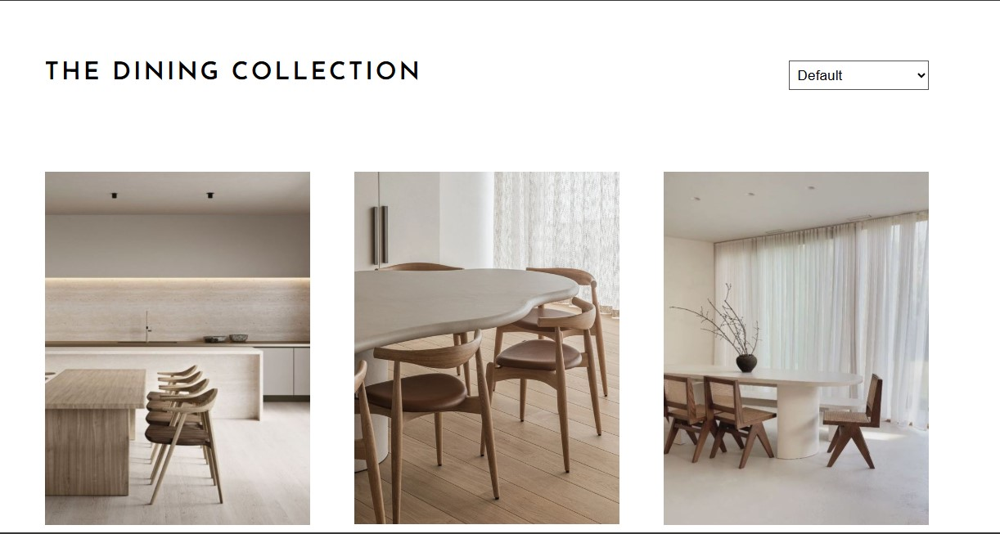
  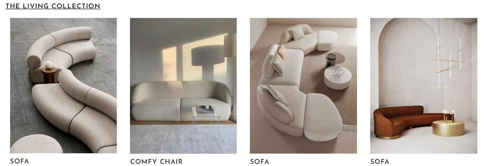

</p>

### ✨ Featured & Gallery  
<p align="center">
  
  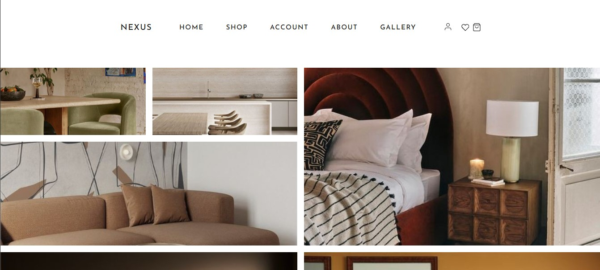
  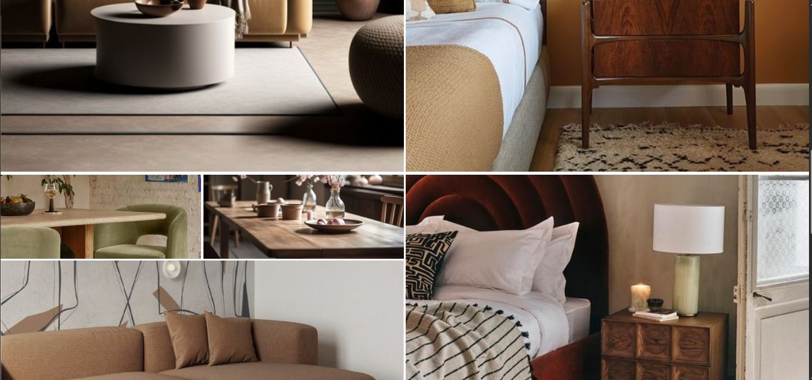
  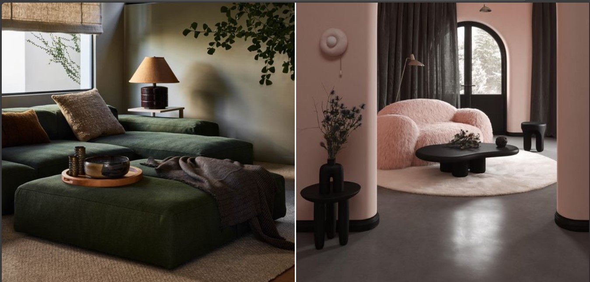
</p>

### 💡 Inspiration & Login  
<p align="center">
  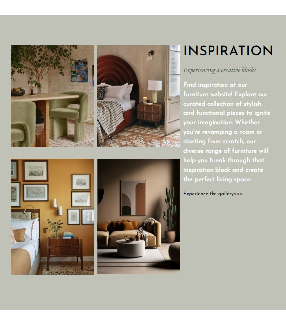
  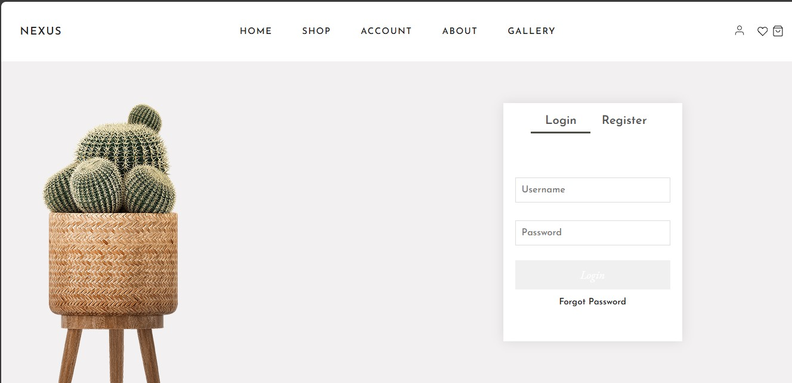
</p>

### 📑 Footer  
<p align="center">
  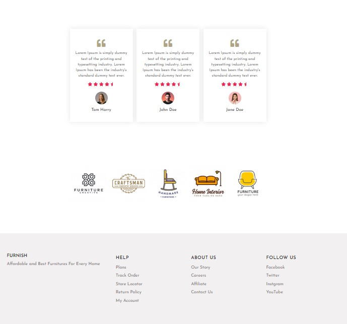
</p>

---


## ⚡ Getting Started

### 1️⃣ Clone the repository
```bash
git clone https://github.com/EishaQaisar/NEXUS--furniture_website.git
cd NEXUS--furniture_website
```
### 2️⃣ Install dependencies
```bash

npm install
```
### 3️⃣ Set up environment variables
Create a .env file in the root folder:
```bash
MONGO_URI=your_mongo_connection_string
```

### 4️⃣ Run the app
For development (with nodemon):
```bash

nodemon src/index.js
```


## 📄 License

This project is licensed under the **MIT License** – you are free to use, modify, and distribute this project for personal or commercial purposes as long as proper credit is given.  
See the [LICENSE](./LICENSE) file for full details.


